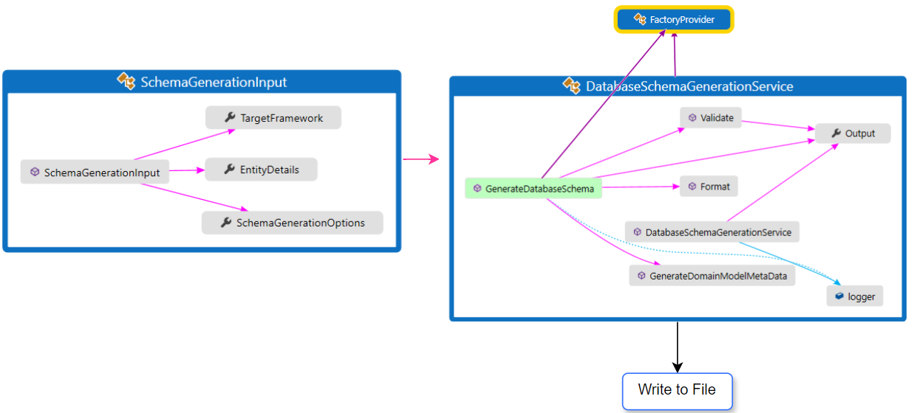

# Database Schema Engine

# Overview

This library provides methods to generate database schema based on the target database framework. Currently supported database frameworks are SFCDB and SQLite.

**IDatabaseSchemaGeneratorService** service interface provides the method **GenerateDatabaseSchema**, which accepts Target Database Framework, Entity Details and Formatting Rules as input. The generated schema content is written to the configured file path. More configuration and input details are provided in below sections.

*
Flow Diagram
*

# Prerequisites
To use the specific database framework version, below setup is required.

## Application Configuration Settings

This library targets the  **Dot Net Version - .Net 6.0**.

There is a common setup required to generate the metadata, regardless the database framework version you want to use.

**Common Setup**
- Domain Model Metadata Output File Path - This is a file path for domain model metadata, which will be generated for the entities. Once generated, this file can be edited and used for regeneration of database schema. Replace the DOMAINMODEL_METADATA_OUTPUT_PATH with actual path in your machine.

        <add key="schema:domain-model-metadata:File.outputPath" value="DOMAINMODEL_METADATA_OUTPUT_PATH" />

*Sample file for the DomainModelMetadata prvided in the path* [Domain Model Metadata Sample](/DatabaseSchemaEngine/Samples/Domain Model Metadata). System will generate this file, still user can place the file from Sample folder and modify as per requirement. System will detect this file and will ask user's confirmation if this file should be used for schema generation.

- Allow Entity Update - If user wants to update the entities from the metadata file, the value for below setting can be set as true. This setting expects a boolean value *true* or *false*

        <add key="schema:domain-model:allowEnityUpdateFromFile" value="false" />

The below setups are specific to target database framework.

**SCFDB**
- Template Directory Path - This path will contain the template files required for SFCDB schema generation. Replace the TEMPLATE_PATH with the actual path on your machine.
         
        <add key="schema:sfcdb:database-schema-template:Directory.path" value="TEMPLATE_PATH" />
- Output Directory Path - This path will contain the database schema files generated by the schema engine. Replace the OUTPUT_PATH with actual path on your machine.

        <add key="schema:sfcdb:database-schema:Directory.outputPath" value="OUTPUT_PATH" />

**SQLite**
- Template Directory Path - This path will contain the template files required for SQLite schema generation. Replace the TEMPLATE_PATH with the actual path on your machine.

        <add key="schema:sqlite:database-schema-template:Directory.path" value="TEMPLATE_PATH" />
- Output Directory Path - This path will contain the database schema files generated by the schema engine.Replace the OUTPUT_PATH with actual path on your machine.

        <add key="schema:sqlite:database-schema:Directory.outputPath" value="OUTPUT_PATH" />

# Template Files
Template files will be placed in the directory as configured in last step for individual target framework. Below are the template files **names** and **formats** for respective target database framework.

For referece, please see the files in the path [Schema Templates](/DatabaseSchemaEngine/Samples/Schema Templates). And place these files in the configured directories.

**SFCDB**

File name : SFCDBDataStoreTemplate.df

    START DATASTORE DEFINITION FOR: <data store name>
    <prop>
    END DATASTORE DEFINITION

File name : SFCDBPropTemplate.df

    PROP
        NAME: <property name>
        TYPE: <type specification>

**SQLite**

File Name : SQLiteTableTemplate.df

    CREATE TABLE <table name>(
    <column>
    );

File Name : SQLiteColumnTemplate.df

        <column name> <type specification>

# Using the Library

This library provides a service interface IDatabaseSchemaGeneratorService. To generate the database schema call the method IDatabaseSchemaGeneratorService.GenerateDatabaseSchema.

Fill the input details for type of ISchemaGenerationInput.

**Input**
- TargetFramework - type of TargetDatabaseFrameworkValues :Target database framework for which schema to be generated.
- EntityDetails - type of IEnumerable of IEntityDetail : List of entitites which will be processed.
- FormattingRules - type of IEnumerable of ILookup : List of formatting rules applicable for schema formatting. 

This service call with generate following output of type ISchemaGenerationOutput

**Output**
- ValidationMessages - type of List of string : Validation messages for the schema input.
- IsSuccess - type of bool: Indiactes if the schema generation was successful.

# Adding Support For a New Database Framework
To support a new target database framework, below implementation will be required.
- Add configurations  for Template Directory and Schema Output path as done above for SCFDB and SQLite.
- Implement the Interface **IDatabaseSchemaGenerator**, common functionality is already implemented in the the base abstaract class **SchemaGeneratorBase**. So this class can be used if it meets the requirements.
- Override the methods of **SchemaMapperBase** (if required), to provide the target framework to fetch the correct data mapping details.
- Override the **SchemaValidatorProviderBase** to register the validations for the target database framework.
- Override the **ValidationMessageProviderBase** to customize the validation messages.

You can refer the changes done to support SQLite database framework : https://github.com/singhraghuveer31/Assignments/commit/f12de2d9ce98d72e8bb9575528974ea320f82528?diff=unified&w=0
