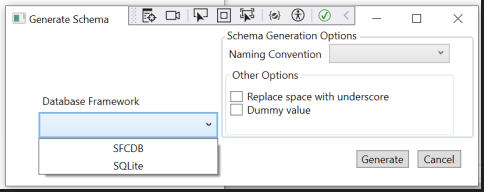

# User Story 1
## Overview
Enhanced the existing functionality of **Generate Schema** to choose a target Database Framework and generate .mdl file for selected database.

## Configuration Requirements
This functionality needs configuration setup, please check the **Application Configuration Settings** section in the file
https://github.com/singhraghuveer31/Assignments/blob/master/DatabaseSchemaEngine/README.md

## Implementation Details
When user opens Generate Schema pop, below behavior is expected on the screen.
- User will be able to see a new drop down with name Database Framework.

- When user click on the **Generate** button,

	- if no Database Framework version selected, error message will pop up to select a value.
	
	

	- if there are validation errors then a pop up with error messages will be diplayed.

	
    
    otherwise pop up with sucess message will diplay.
	
	
  
    and file should be generated in the configured path.
