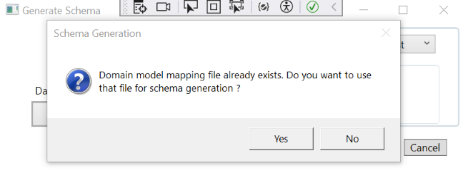

# User Story 2
## Overview
Provided the capability to generate a domain model metadata which user can modify and use that for generating the schema file.

## Configuration Requirements
This functionality needs configuration setup, please check the **Application Configuration Settings** section in the file
https://github.com/singhraghuveer31/Assignments/blob/master/DatabaseSchemaEngine/README.md

## Implementation Details
- When user selects a Database Framework and click on the **Generate** button, a domain maaping file for the available entities will be generated in the configured path.
- If file already exists, user should be able to see a popup for confirmation if they should use this file or not, for generating the database schema.
  
	

	If user clicks on **Yes**, domain mapping file will be used for generating the database schema, otherwise existing entities will be used for database schema generation.
- This file will be in json format, naming of the file will be as configured in the settings.
