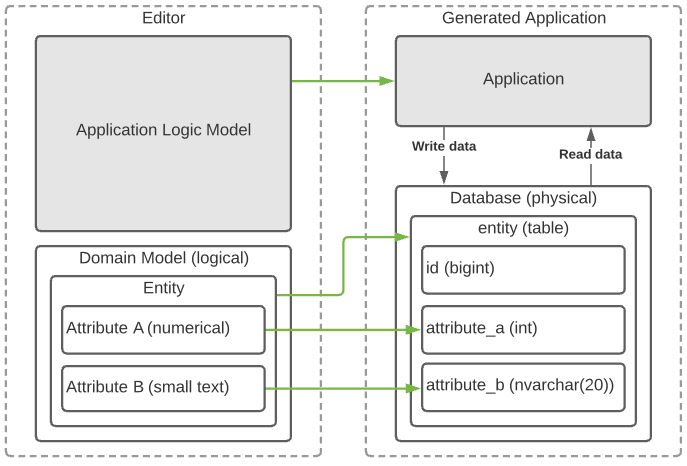

# Assessment Studio Pro - Backend

# Introduction

Dear Mendix Studio Pro Developer,

This assessment is intended to give insights on your coding and logical thinking skills. So please treat this assignment the same as working for Mendix.
This assessment consists of a backlog with three User Stories that need to be implemented.

If you have any questions at all, do not hesitate to contact us.

* Before starting your assignment, please run* `*git init && git add . && git commit -am "initial commit"*` *so that we can track your changes from the base line.*
Good luck and enjoy!
* There is also an optional bonus story that you can implement if time permits - **you are expected to keep the necessity to implement this story in mind when developing the application**

# Assignment

Implement the User Stories from the backlog described later in this document. Present your results and findings via screen share. We'll have a discussion to understand your reasoning, chosen methodologies and technology while working on the User Stories.

Please treat this assignment the same as working for Mendix. This includes your due diligence for code style, best practices, design, and testing coverage.

# Running the application

Install Visual Studio Community Edition. You can download it from:
[https://www.visualstudio.com/thank-you-downloading-visual-studio/?sku=Community&rel=15](https://www.visualstudio.com/thank-you-downloading-visual-studio/?sku=Community&rel=15)
Load the solution `InterviewAssessment.sln`

# Background information

One of the components of Mendix Studio Pro is the Domain Model Editor. The Domain Model Editor is used to model out the conceptual representation of the application’s data. It consists of entities, their attributes and associations between them.

Ultimately the created model is used to generate a database schema to be used by a running application. Different databases are supported by Mendix, each having slightly different requirements for their schemas.

The project you have received contains a working but very rough Domain Model Editor that supports creating Entities and Attributes. With that out of the way, we want to create a slice of the full functionality as quickly as possible. This means that the next step is to generate the database schema from the domain model. That is where you come in. Check out the backlog below to see what is needed to achieve this.

# Backlog
## User Story 1

The first database we are going to target is a new (fictional) cloud database called SFCDB. The goal of this story is to allow the user to choose SFCDB as the target platform for which to generate the database schema. You will need to create a `.dml`  file with the correct syntax to achieve this. The specs are listed below under the heading “SFCDB Syntax and Semantics".

**Acceptance Criteria:**

- The user can choose to export SFCDB schema for the domain model.
- The valid schema is then generated and saved to the file.
- Any errors are gracefully handled.
- A `.dml` file is generated conforming to the specification in “SFCDB Syntax and Semantics”

## User Story 2

We want to be able to translate the created schema back to the domain model and in time be able to update it. To do this we need the mapping between the domain model and the schema that is generated.

**Acceptance criteria:**

- A mapping file is generated when the schema is generated.
- It is in a machine and human-readable format
- If the file already exists, read its content, and use the provided mapping while generating the schema
## User Story 3

Some customers would like Mendix to stick to a specific naming convention while creating a schema, for example, to align with their in-house solutions.

Hence, we need to implement a few of such naming conventions (e.g. “all capital”, camel case, snake case, etc) and give a user a choice, which one(s) to use.

**Acceptance Criteria:**

- When a user chooses to generate a schema, the naming convention(s) to apply or not to apply can be selected.
- At least “capital case first” and “replace space with underscore” naming conventions are implemented, but it should be easy to implement a new one later on.
## User Story 4 (bonus)

Note, this is a bonus story, you do not have to implement it. But take this story into account while designing the code you create for the previous user stories.

We would like to support other database types than SFCDB. We will start with SQLite which schema file is just a `.sql` file with `CREATE TABLE` statements as defined in the specification for SQLite here: https://www.sqlite.org/lang_createtable.html.

**Acceptance Criteria:**

- A user can select a SQLite database type for which to export a schema.
- A valid `.sql` file is generated that could be used to actually create the database. 
# SFCDB Syntax and Semantics

The Super Fast Cloud DataBase (SFCDB) is a data platform to support your most demanding data intensive applications. This short guide details the syntax to create your data model schema. SFCDB works with data stores, which you could compare to entities in a regular database. Each datastore can have properties and each property must have a type. The regular file extension for SFCDB data model schema files is `.dml`.

| SFCDB Type      | C# Type | Descriotion                            |
| --------------- | ------- | -------------------------------------- |
| unlimited_text  | string  | A text property of unlimited length.   |
| small_numerical | int     | A numerical field, less than 1024      |
| numerical       | int     | A numerical field comparable to an int |

Data store names should adhere to the following rules:

- Are always 8 characters long
- Must start with a letter
- May contain upper and lowercase characters
- May contain numbers, _, and -
- Must be unique

Property names should adhere to the same rules as entity names, except:

- They must be between 4 and 16 characters long
- Must be unique across data stores

Syntax definition for data model definition files:

- indents are two spaces
- A data model definition file can contain multiple definitions separated by: `// ---`

**A single datastore definition example:**

    START DATASTORE DEFINITION FOR: <data store name>
    PROP
      NAME: <property name>
      TYPE: <type specification>
    END DATASTORE DEFINITION
    // ---
    ...

**An example file for two data stores:**

    START DATASTORE DEFINITION FOR: first_ds
    PROP
      NAME: id_ds1
      TYPE: numerical
    PROP
      NAME: attr1
      TYPE: unlimited_text
    END DATASTORE DEFINITION
    // ---
    START DATASTORE DEFINITION FOR: secnd_ds
    PROP
      NAME: id_ds2
      TYPE: numerical
    PROP
      NAME: value
      TYPE: small_numerical
    END DATASTORE DEFINITION

